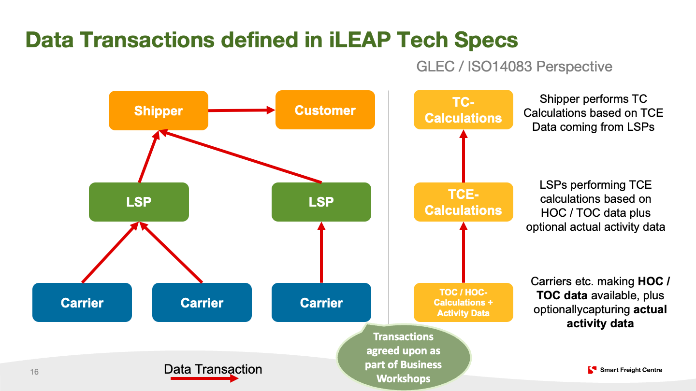

# Pilot and Real-World Testing

You are looking at documentation created for the iLEAP Project Piloting and Real-World testing Phases.
The Piloting Phase is a 3-month period where the iLEAP Tech Specs are tested by Implementers in a real-world-like settings.
The Real-World Testing Phase will follow it and it is a 3-month period where the iLEAP Tech Specs are used in real-world settings.

The goal of the Piloting and Real-World Testing Phases is to ensure that the iLEAP Tech Specs are ready for real-world usage by Shippers, LSPs, and Carriers, etc.

This document provides an overview of the Piloting and Real-World Testing Phases, the timeline, key activities, and how to implement the iLEAP Tech Specs.

Further instructions on how to implement and contribute to iLEAP can be found [here](https://sinefoundation.notion.site/iLEAP-Adoption-Guide-d036010d2c7547d99204ea87d79c060f?pvs=74)

# Terminology

Some terminology first:

<dl>
<dt>iLEAP Tech Specs (or just “Tech Specs”)</dt>
<dd>The public specification published <a href="https://sine-fdn.github.io/ileap-extension/">here</a></dd>
<dt>Implementer</dt>
<dd>Any party implementing the iLEAP Tech Specs</dd>
<dt>Shipper</dt>
<dd>Any company buying/procuring logistics services. See <a href="https://sine-fdn.github.io/ileap-extension/#transport-service-user">Transport Service User</a> of the iLEAP Tech Specs</dd>
<dt>Logistics Service Provider (LSP)</dt>
<dd>See <a href="https://sine-fdn.github.io/ileap-extension/#transport-service-organizer">Transport Service Organizer</a> of the iLEAP Tech Specs</dd>
<dt>Carrier</dt>
<dd>See <a href="https://sine-fdn.github.io/ileap-extension/#transport-operator">Transport Operator</a> of the iLEAP Tech Specs
</dd>
</dl>

## Situation

We want to bring visibility into logistics emissions based on the ISO14083 and the [GLEC Framework](https://www.smartfreightcentre.org/en/about-sfc/news/a-solid-foundation-to-further-accelerate-freight-decarbonization-smart-freight-centre-releases-updated-glec-framework-version-30/) by working on how independent IT systems exchange information among each other.

We identified as necessary for this:

1. the establishment of a community of Shippers, LSPs, Carriers, and software providers
2. the publication of the [iLEAP Tech Specs](https://sine-fdn.github.io/ileap-extension/) that everyone can implement, defining the necessary means for seamless data exchange (”interoperability”) among participants of the community
3. [Piloting](#piloting-of-ileap) of above specification by the community to make the iLEAP Tech Specs ready for real-world usage

# Piloting of iLEAP

## Timeline / Roadmap

| When                                       | What                                                                                                                                                                          |
| ------------------------------------------ | ----------------------------------------------------------------------------------------------------------------------------------------------------------------------------- |
| May 7th, 2024                              | Kick-Off of iLEAP Piloting                                                                                                                                                    |
| Bi-weekly  (ongoing until end of July) | Check-In of Implementers to give feedback and to coordinate with ongoing activities among each other;  SINE + SFC will continously update the iLEAP Tech Specs as needed. |
| End of July                                | iLEAP Piloting finishes                                                                                                                                                       |
| Mid August                                 | Incorporation of all feedback from iLEAP Piloting and subsequent publication of the “beta version” of the iLEAP Tech Specs                                                    |

## Key Activities

With "iLEAP Piloting" we mean three key activities:

1. Continuous implementation of the iLEAP Tech Specs by Implementers
2. Continuous interoperability testing between independent solutions / software implementing the iLEAP Tech Specs through logistics stakeholders (Shippers, LSPs, Carriers, etc.)
3. Collecting and incorporating feedback from above community to update the iLEAP Tech Specs

TL;DR: **iLEAP Piloting began in May 2024 and it lasted for 3 months**

## Interoperability Testing

Piloting focused on testing the data flows between different parties (see below section on [Transactions](#transactions) for the technical details).

SFC + SINE will

1. perform matchmaking between the parties to form complete chains, e.g. covering a carrier, LSP, and Shipper; etc.
2. support you if you have any (technical) Qs, etc.
3. provide you with technical information necessary for software development etc.

# Real-World Testing of iLEAP

| When                     | What                                                                                                                                                                          |
| ------------------------ | ----------------------------------------------------------------------------------------------------------------------------------------------------------------------------- |
| October, 2024            | Kick-Off of iLEAP Real-World Testing                                                                                                                                          |
| Bi-weekly  (ongoing) | Check-In of Implementers to give feedback and to coordinate with ongoing activities among each other;  SINE + SFC will continously update the iLEAP Tech Specs as needed. |
| January, 2025            | iLEAP Real-World Testing finishes and iLEAP Tech Specs v1 are published                                                                                                       |

## Key Activities

The Real-World Testing Phase will be a continuation of the Piloting:

1. Continuous implementation of the iLEAP Tech Specs by Implementers
2. Continuous interoperability testing between independent solutions / software implementing the iLEAP Tech Specs through logistics stakeholders (Shippers, LSPs, Carriers, etc.)
3. Collecting and incorporating feedback from above community to update the iLEAP Tech Specs

TL;DR: **iLEAP Real-World Testing Phase starts in October 2024. We assume this phase to finish at the end of Q1'25**

## Interoperability Testing

Piloting focused on testing the data flows between different parties (see below section on [Transactions](#transactions) for the technical details).

SFC + SINE will

1. perform matchmaking between the parties to form complete chains, e.g. covering a carrier, LSP, and Shipper; etc.
2. support you if you have any (technical) Qs, etc.
3. provide you with technical information necessary for software development etc.

# About the iLEAP Tech Specs

## Core Concepts and Background

The iLEAP Tech Specs are based upon the [PACT Technical Specifications](https://wbcsd.github.io/data-exchange-protocol/v2/) which defines a generic data model and protocol related to product and service carbon footprints.

The iLEAP Tech Specs are based on this work. They enhance the PACT Tech Specs with additional attributes and concepts related to ISO14083, GLEC Framework, and logistics emissions transparency in general.

The iLEAP Tech Specs define 2 core concepts which are the outcome of a series of workshops with the SFC Community:

**Data Model**

The data model defines how to encode data related to ISO14083 plus activity data. The technical details are specified here:

[iLEAP Technical Specifications (Version 0.2.0)](https://sine-fdn.github.io/ileap-extension/#data-model)

**Protocol**

It defines how the different IT Systems are supposed to exchange information among each other.

To avoid redundant work, we agreed to use the protocol defined in the PACT Technical Specifications. This “PACT Protocol” is already implemented by a multitude of solutions providers. By relying on this protocol, interoperability with Shippers shall be asserted while minimizing the overall work for all participants.

## Transactions

The iLEAP Tech Specs define 3 transactions in [this chapter](https://sine-fdn.github.io/ileap-extension/#txns) (see below for an infographic):

1. **TCE Data Exchange**

    This typically happens between e.g. a LSP and a Shipper.

    Likewise, Carriers can also make TCE data available to an LSP (or a Shipper) if they are able to calculate TCEs (already).
    If they are not, Carriers *can* make actual activity data available (see Transaction 3). If a carrier does not make such data available, the GLEC Framework defines additional options to calculate emission factors then – which can be either done by a Shipper, or typically through an LSP.

    In the latter case, the LSP can then make TCE data available to a shipper as already mentioned.

2. **TOC and HOC Data Exchange**

    TCEs refer to TOCs or HOCs to disclose emission intensities at a cluster-level (see ISO14083, GLEC Framework for further details). The TCE data model explicitly references TOCs or HOCs but do not contain them.

    That is, if a Shipper is interested in the TOC or HOC definition, related emissions intensities, etc. , the Shipper *can* request TOC or HOC data from its business partners.

    Again, a TOC or HOC *can* be made available by any party (Carrier, LSP, etc.) from a technical standpoint.

3. **Transport Activity Data Exchange**

    Transport Activity Data Exchange allows e.g. a Carrier lacking the capabilities to calculate TCE or TOC-level data to disclose Activity Data to an LSP or Shipper.

    Activity Data here is data that discloses distance, weight, and other attributes related to the energy (carrier) used etc. so that the party receiving Activity Data can derive emission and other values from it.

# Implementating the iLEAP Tech Specs

As an implementer of the iLEAP Tech Specs, you need to implement the PACT Technical Specification plus the iLEAP Data Model and iLEAP HTTP API. Several pointers with details are [given below](#implementation-roadmap). In addition to what you can find in this document, the iLEAP Tech Specs are more specific (and thorough) in what you need to implement. Take a look at [this chapter](https://sine-fdn.github.io/ileap-extension/#http-rest-api) for details.

### Implementation Roadmap

As an implementer, you need to perform the following (as detailed [here](https://sine-fdn.github.io/ileap-extension/#http-rest-api)):

1. Implement the PACT Tech Specs covering the basic Data Model and HTTP API (see above for resources on this)
2. Implement the iLEAP Tech Specs:
    1. Implementing the [TCE](https://sine-fdn.github.io/ileap-extension/#dt-tce), [TOC](https://sine-fdn.github.io/ileap-extension/#dt-toc), and [HOC](https://sine-fdn.github.io/ileap-extension/#dt-hoc) Data Types and the ability to embed this information into the PACT Data Model. The latter is specified in the iLEAP Tech Specs Chapter “[PACT Integration](https://sine-fdn.github.io/ileap-extension/#pcf-mapping)”. Examples are given in the [examples chapter](https://sine-fdn.github.io/ileap-extension/#appendix-a).
    2. Implementing the exchange of [Transport Activity Data (TAD) Data Type](https://sine-fdn.github.io/ileap-extension/#dt-tad) plus related [HTTP API for the exchange of Transport Activity Data](https://sine-fdn.github.io/ileap-extension/#action-tad).

### Technical Support Material

Introduction documentation for the PACT Tech Specs can be found here:

[PACT Initiative Developer Documentation](https://wbcsd.github.io/introduction/)

The actual PACT Technical Specifications, written similarly to the iLEAP Tech Specs, can be found here:

[Technical Specifications for PCF Data Exchange (2.2.0)](https://wbcsd.github.io/tr/2024/data-exchange-protocol-20240410/)

As mentioned above, the iLEAP Tech Specs are defined here (and will be updated subsequently during piloting):

[iLEAP Technical Specifications (Version 0.2.0)](https://sine-fdn.github.io/ileap-extension/)

### iLEAP Demo API

In addition, there is a public demo endpoint which you can use for your own internal software-testing and development works:  [https://api.ileap.sine.dev/](https://api.ileap.sine.dev)
You can authenticate against above api using the following credentials:

| client_id                     | client_secret | Data                                                           |
| ----------------------------- | ------------- | -------------------------------------------------------------- |
| `hello`                       | `pathfinder`  | Global access to all sample data                               |
| `transport_service_user`      | `ileap`       | User is a (demo) shipper. Access to ShipmentFootprints and TAD |
| `transport_service_organizer` | `ileap`       | User is (demo) LSP. Access to TOCs, HOCs, and TAD              |
| `random_data`                 | `random_data` | Access to randomly generated iLEAP data                        |

Furthermore, you can find a Swagger UI related to above here: [https://api.ileap.sine.dev/swagger-ui/index.html](https://api.ileap.sine.dev/swagger-ui/index.html)

### ACT (Automated Conformance Testing)

SINE is implementing ACT, an Automated Conformance Testing tool that will allow you to test your implementation against the iLEAP Tech Specs.

The Web version of ACT is available at [https://act.sine.dev](https://act.sine.dev). You can also integrate ACT in your CI/CD pipeline. Please find more information [here](https://github.com/sine-fdn/act).

Please note that ACT is currently in its beta phase. If you have any questions or feedback, please get in touch with us through [act-feedback@sine.dev](mailto:act-feedback@sine.dev).

### Demo Data

Please use SINE's demo API to access the demo data (both sample data and randomly generated).
